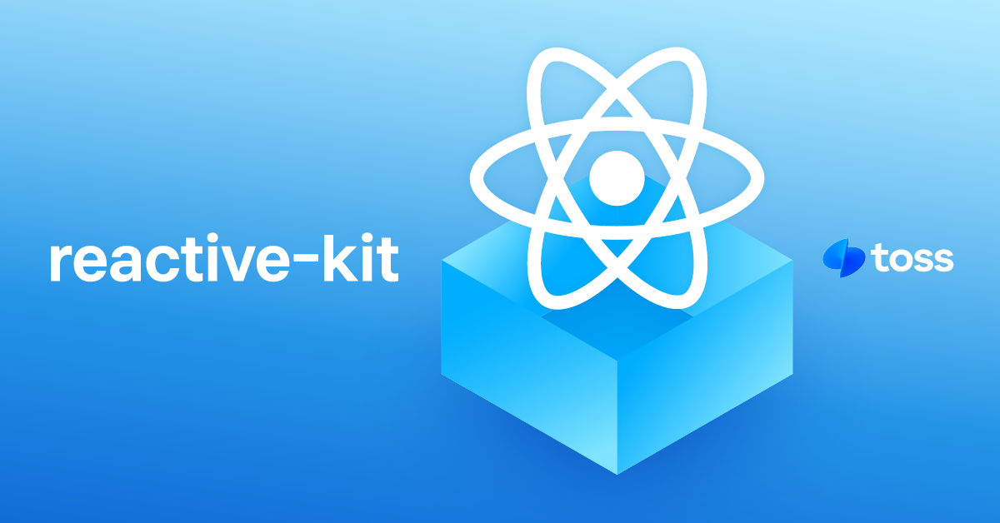

# react-simplikit &middot; [](https://github.com/toss/slash/blob/main/LICENSE) [](https://codecov.io/gh/toss/react-simplikit) [](https://discord.gg/vGXbVjP2nY)

English | [Korean](./README-ko_kr.md)

`react-simplikit` is a lightweight yet powerful library that provides various utilities for use in React environments.

- `react-simplikit` is dependency-free, making it extremely lightweight.
- `react-simplikit` guarantees reliability with 100% test coverage.
- `react-simplikit` offers JSDoc comments, detailed documentation, and examples to ensure any developer can easily use it.

## Example

```tsx
import { useBooleanState } from 'react-simplikit';

function Component() {
  // using the `useBooleanState` hook to manage state.
  const [open, openBottomSheet, closeBottomSheet, toggleBottomSheet] =
    useBooleanState(false);

  return (
    <div>
      <p>Bottom Sheet State: {open ? 'Open' : 'Closed'}</p>
      <button onClick={openBottomSheet}>Open</button>
      <button onClick={closeBottomSheet}>Close</button>
      <button onClick={toggleBottomSheet}>Toggle</button>
    </div>
  );
}
```

## Contributing

Contributions are welcome from everyone in the community. Please check the contribution guide linked below.

[CONTRIBUTING](./src/docs/en/contributing.md)

## License

MIT © Viva Republica, Inc. For more details, see [LICENSE](./LICENSE)
